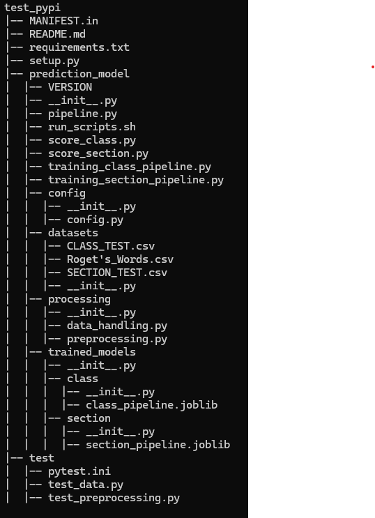

# Roget Thesaurus Classification MLOps Project (UNDERDEVELOPMENT)

This project is an end-to-end MLOps pipeline designed to classify words based on their semantic categories in Roget's Thesaurus.
The pipeline loads data previously extracted from [Roget's Thesaurus](https://www.gutenberg.org/cache/epub/22/pg22-images.html), generates embeddings using the Gemma 1.1 2B it model, performs dimensionality reduction and Standard Scaling, and uses an XGBoost model to predict the semantic category or section for each word.

## Installation and Dependencies

The code is available as a python library through TestPyPI by running the following command in the CLI:

```bash
pip install -i https://test.pypi.org/simple/ roget-thesaurus-classification
```

To run train and predict with the pipeline, make sure you have the necessary libraries by running the command with the downloaded requirements file:

```bash
pip install -r requirements.txt
```

## Pipeline Overview

The pipeline consists of the following key stages:

1. **Embedding Generation**: Word embeddings are generated using the Gemma 1.1 2B model, which converts words into dense vector representations based on their semantic meanings.

2. **Standard Scaling**: The embeddings are standardized to ensure that the features have a mean of 0 and a standard deviation of 1, helping improve the performance of downstream models.

3. **Dimensionality Reduction**: We apply UAMP dimensionality reduction techniques to reduce the complexity of the embeddings.

4. **Standard Scaling**: The embeddings are standardized to ensure that the features have a mean of 0 and a standard deviation of 1, helping improve the performance of prediction models.

5. **Classification**: An LightGBM classifier is trained to predict the semantic category (or section) for each word, based on the processed embeddings.

## Project Structure



## TODO

mlflow
MLApps
Jenkins
fastapi
docker
