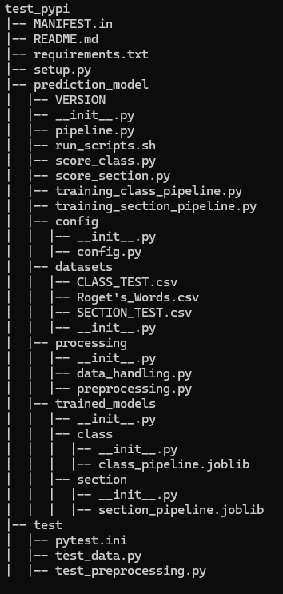
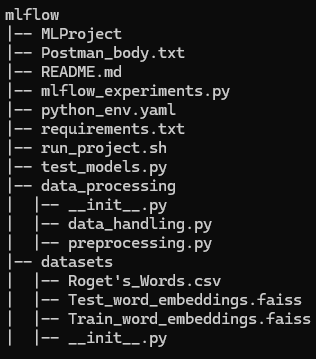

# Roget Thesaurus Classification MLOps Project (UNDERDEVELOPMENT)

This project is an end-to-end MLOps pipeline designed to classify words based on their semantic categories in Roget's Thesaurus.
The pipeline loads data previously extracted from [Roget's Thesaurus](https://www.gutenberg.org/cache/epub/22/pg22-images.html), generates embeddings using the Gemma 1.1 2B it model, performs dimensionality reduction and Standard Scaling, and uses a LightGBM model to predict the semantic category or section for each word.

## Pipeline Overview

The pipeline consists of the following key stages:

1. **Embedding Generation**: Word embeddings are generated using the Gemma 1.1 2B model, which converts words into dense vector representations based on their semantic meanings.

2. **Standard Scaling**: The embeddings are standardized to ensure that the features have a mean of 0 and a standard deviation of 1, helping improve the performance of downstream models.

3. **Dimensionality Reduction**: We apply UMAP dimensionality reduction techniques to reduce the complexity of the embeddings.

4. **Standard Scaling**: The embeddings are standardized again after the dimensionality reduction to ensure that the features have a mean of 0 and a standard deviation of 1, helping improve the performance of the classification models.

5. **Classification**: An LightGBM classifier is trained to predict the semantic category (or section) for each word, based on the processed embeddings.

## TestPyPI Project

The TestPyPI project is dedicated to create a library where any one can recreate the pipeline above pipeline and use it for personal uses to classify words according to Roget's Classes and Sections. The pipeline code is also available as a python through TestPyPI by running the following command in the CLI:

```bash
pip install -i https://test.pypi.org/simple/ roget-thesaurus-classification
```

In order to use the pipeline you must retrain it locacly with the use of the training scripts in the test_pypi directory. To run the training, and score with the pipeline, make sure you have the necessary libraries by running the command with the downloaded requirements file:

```bash
pip install -r requirements.txt
```

**WARNING:** Running the training pipeline scripts in the testpypi dir is essential if you have downloaded the repository and want to run it. As the models are several GB in size, they have not been uploaded to github and you will need to re-run the trainings. The process is reproducible, so we will end up with almost the same results (considering that the use optuna in the LGBM optimization is the only non-deterministic process in the pipeline). The joblib files that appear in the trained models dir of the testpypi need to be duplicated in the same folder of the streamlit web app server dir so that they can be used in the prediction process.

## TestPyPI Project Structure



## Mlflow Project

The mlflow project is dedicated in the optimazation of the machine learning models that will predict the Class or the Section of the given word embeddings. The process is divided in two parts. First is the embeddings generation where a pipeline is trained on train set to generate the word embeddings using the last hidden state of the Gemma 1.1 2B model and also predicts the test set embeddings. This process is ilustrated in the directories, data_processing and datasets. When the embeddings are generated and stored in vector dbs then comes the mlflow traching and experimantation. The mlflow_experimantation coducts 2 experimentations, depending on the parameters given on the execution. One is the Class and the other is the Section experimentation. In its experementation a set of machine learning models are optimized using the optuna and stored (parameters and model instances) in the the Roget_Classification experiment.

***For more info on how to run the mlflow project visit the mlflow/README.md file.***

## Mlflow Project Structure



## Streamlit Web App

The Streamlit web application is designed to offer a realistic and interactive experience with the entire data insights and prediction process. It follows a client-server architecture, where the Streamlit app operates as the client, and all data processing and prediction tasks are handled by a FastAPI server running on a separate port. Communication between the client and server is facilitated through APIs, ensuring seamless integration and efficient data exchange.

## Streamlit Web App Project Structure


## TODO

Jenkins
github-actions
Flask_web_app
